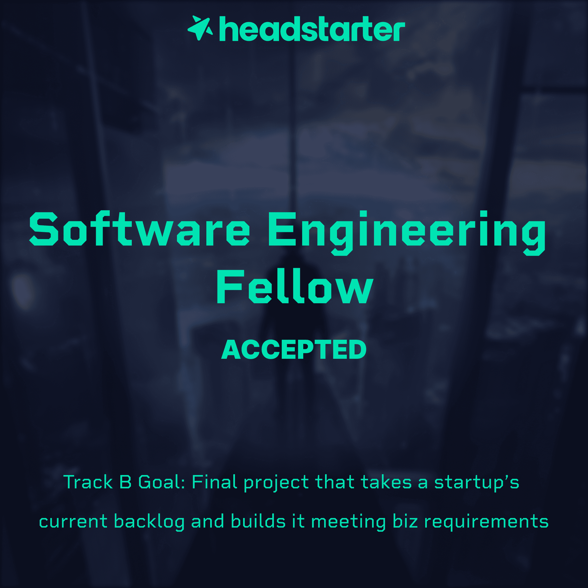

# Headstarter-Projects
"So, I have some news to share. 
I am now a Headstarter Software Engineering fellow.  
I will be doing building 5 AI projects in 5 weeks and and as my final project :  
I will be trying to **create a project that takes a startup's current backlog and builds it meeting biz requirements**.   

The part I am most excited about this fellowship is I will be able to build my :  
1.Vision  
2.Personal brand  
3.Interview prep  
4.Project  
5.Feedback  

I look forward to sharing my progress and technical growth over the next few weeks. 
#Headstarter #SoftwareEngineering #ComputerScience

  
